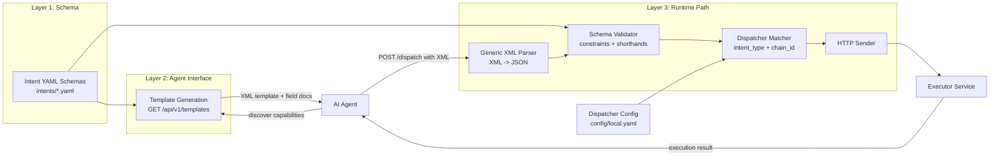

# TIM System Diagram

This diagram is the paper-facing view of the current repository architecture. It stays intentionally close to the implementation and existing design docs.

## Diagram invariants

- Schema remains the source of truth for both agent-facing templates and runtime validation.
- The XML parser is generic; adding a new intent type should not require parser changes.
- Dispatch stays config-driven and executor-agnostic.
